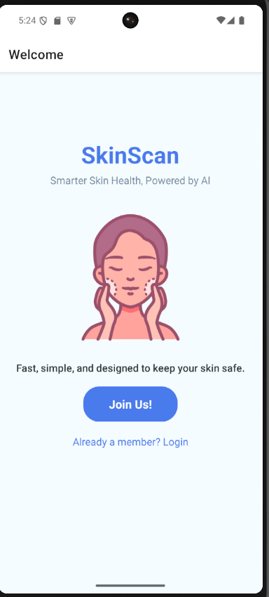
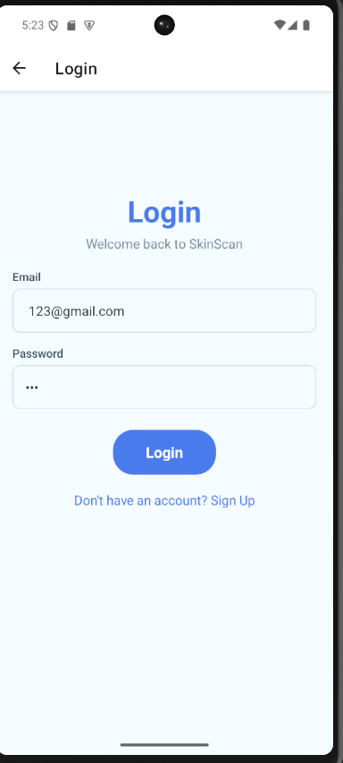
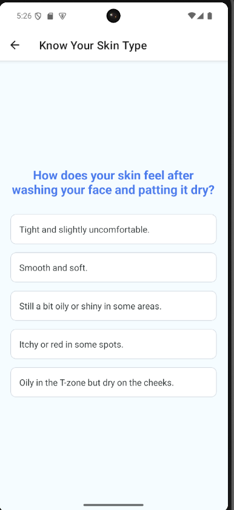
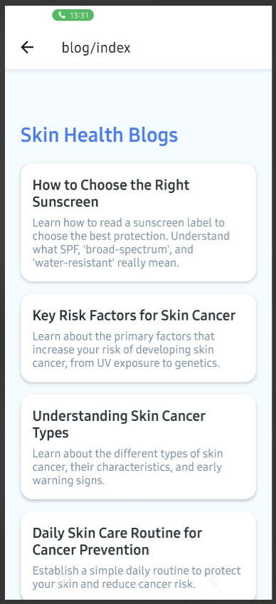
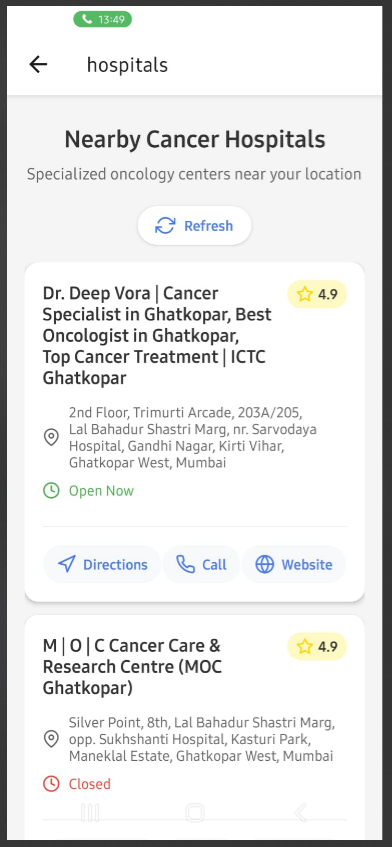
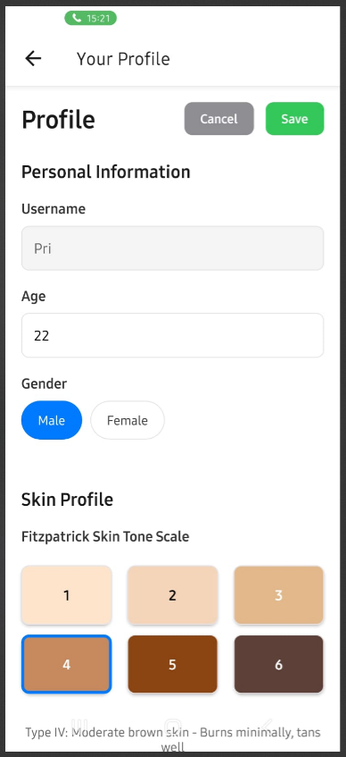
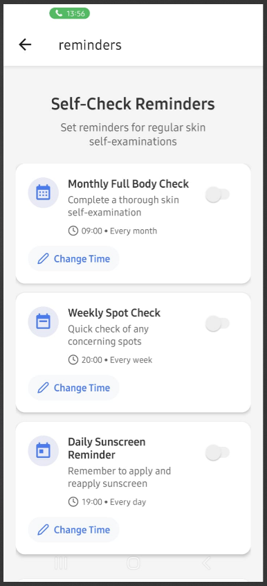
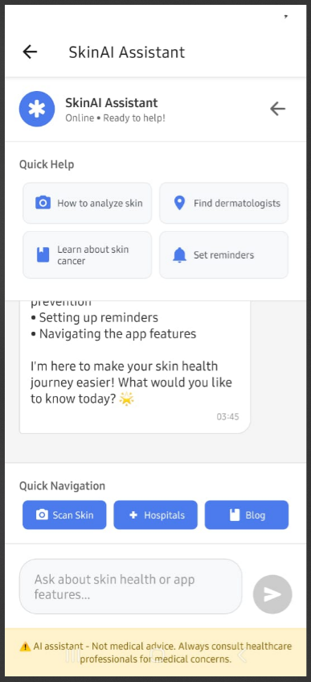

# SkinScan App 🩺📱

**SkinScan** is a cutting-edge mobile application designed to empower users to proactively monitor their skin health. Using a combination of advanced **AI-powered computer vision** and interactive features, the app provides a comprehensive solution for **early skin lesion detection**, skin care guidance, and personalized health recommendations.

The primary goal is to provide an accessible and user-friendly tool that encourages consistent monitoring and enhances awareness of potential skin health issues.

---

## 🌟 Features

### 1. Real-time Lesion Detection
- **Fast, on-device detection** using a custom-trained **YOLOv8** model.
- Automatically localizes skin lesions in images captured by the user's phone camera.
- Ensures only valid, correctly cropped lesion images are passed to the classifier for maximum accuracy.

### 2. Multi-class Lesion Classification
- Classifies lesions into **6 clinically relevant categories**:
  - **MEL** (Melanoma)
  - **BCC** (Basal Cell Carcinoma)
  - **SCC** (Squamous Cell Carcinoma)
  - **AK** (Actinic Keratosis)
  - **NEV** (Nevus)
  - **SEK** (Seborrheic Keratosis)
- Uses **lightweight CNN models** (MobileNetV3, EfficientNet-lite) optimized for mobile deployment.
- **Quantization and pruning** techniques applied to ensure low latency and small model size.

### 3. Know Your Skin Type & Risk Assessment
- An interactive questionnaire assesses the user's skin type (dry, oily, combination, sensitive, etc.).
- Provides **personalized skincare recommendations** and evaluates the potential **risk of developing skin cancer** based on user responses (e.g., sun exposure history, family history).

### 4. Chatbot Integration
- An embedded **AI chatbot** offers real-time assistance.
- It can answer user questions about suspicious lesions, provide general skin health and lifestyle tips, and offer preventive measures.
- Designed to enhance user engagement and provide immediate, context-aware guidance.

### 5. Regular Check Reminders
- Users can opt-in for **periodic reminders** to perform self-checks and document new or changing lesions.
- Encourages consistent monitoring and chronological tracking of skin health.

### 6. Location-based UV & Temperature Suggestions
- Fetches **real-time UV index and local temperature** based on the user’s location (via OpenWeather API).
- Offers timely, preventive tips:
  - Reminder to apply sunscreen during high UV hours.
  - Suggestion to limit outdoor exposure at peak sunlight times.
  - Hydration and appropriate skin protection advice.

### 7. Educational Content
- Curated resources including **videos, blogs, and articles** on:
  - Skin cancer awareness and facts
  - Effective prevention strategies
  - Daily and seasonal skin care best practices
- Aims to enhance user awareness and foster proactive skin health management.

### 8. Mobile Optimization
- The UI is designed for an intuitive, smooth user experience on smartphones.
- Lightweight model deployment ensures **low latency and minimal battery consumption**, making it practical for daily use.

---

## 📸 Screenshots 

| Landing Page | Login Page | Skin Type | Blogs | Hospitals | Profile | Reminder | Skin AI |
| :---: | :---: | :---: | :---: | :---: | :---: | :---: | :---: |
|  |  |  |  |  |  |  | 

---

## 🚀 Installation & Setup

### Prerequisites

- Node.js & npm
- Python 3.x
- Expo CLI

### 1. Clone the repository

```bash
git clone [https://github.com/NirmitGavate/SkinScan-App.git](https://github.com/NirmitGavate/SkinScan-App.git)
cd SkinScan-App
```
##  Project Structure
```graphql
SkinScan-App/
│
├─ app/                # React Native screens, navigation, and components
├─ backend/            # Flask API, image handling, model serving, and blogs
├─ models/             # Pretrained YOLOv8 and CNN classification models
├─ assets/             # Images, icons, fonts, and placeholder content
├─ package.json        # Frontend dependencies
└─ README.md
```
## 🛠 Tech Stack

| Category | Key Technologies |
| :--- | :--- |
| **Frontend** | React Native, Expo Router |
| **Backend** | Python, Flask, MongoDB |
| **AI/ML Models** | YOLOv8 (Lesion Detection), ResNet50 (Classification) |
| **Integrations** | Expo Image Picker, OpenAI API, WeatherBit API (UV & Temperature), Google Maps API |
